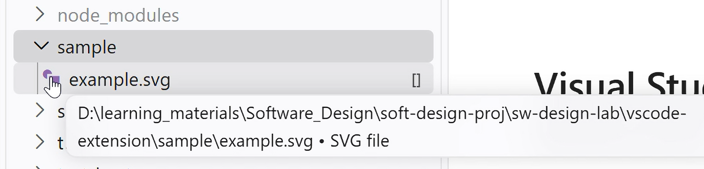
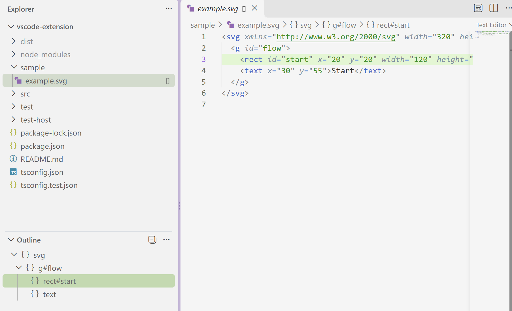
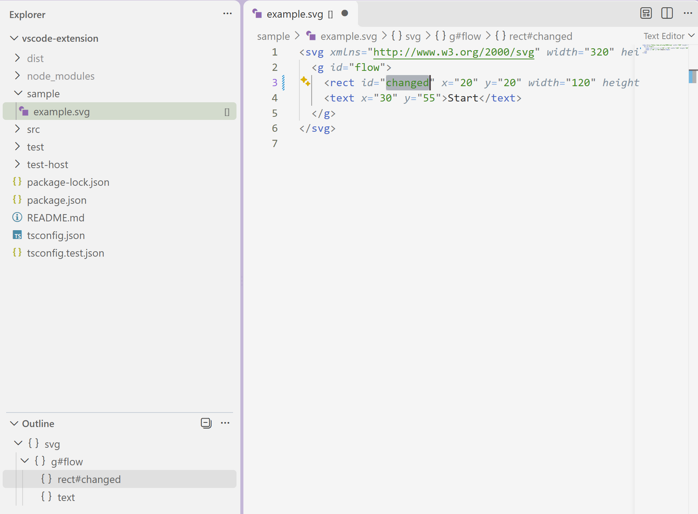
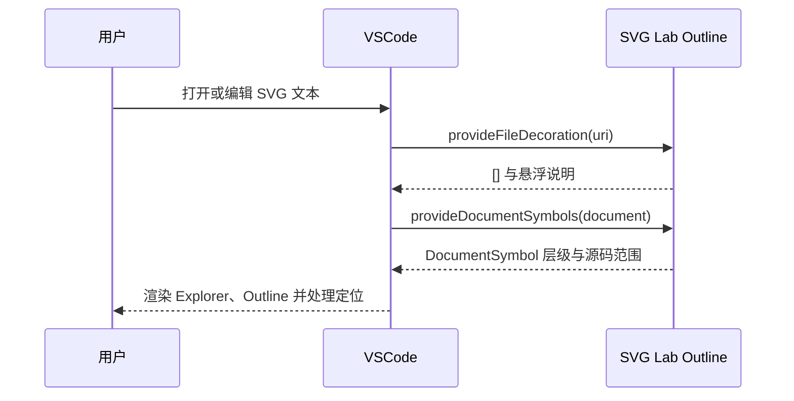
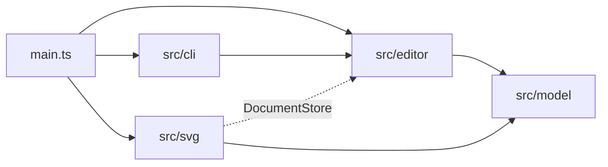
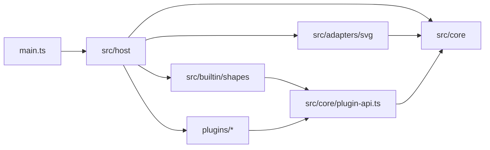
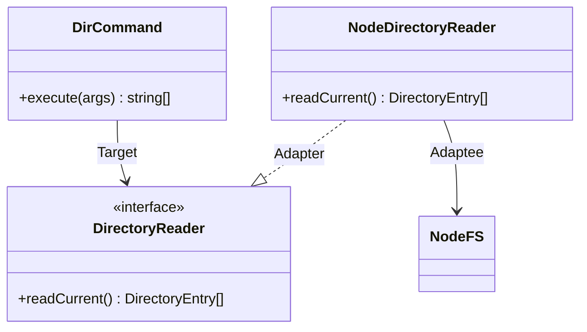
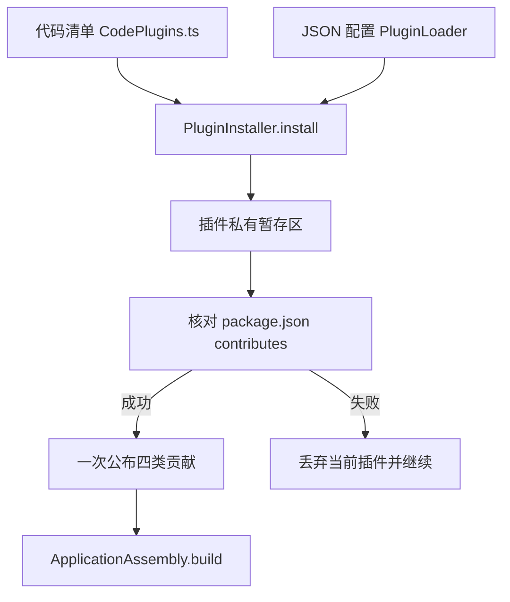

# Lab1 Phase 2 实验报告：VSCode 插件实践与 SVG CLI 插件式重构

## 1. 实验目标与完成结果

本实验包含两个相互独立又共同体现扩展机制的任务：一是在 VSCode 中为 SVG 文件提供 Explorer 标记与原生 Outline；二是在保持 Phase 1 行为不变的前提下，将 SVG CLI 重构为可通过图形、命令、树标签和属性处理器扩展的插件式框架。

实现结果如下：

- VSCode 扩展通过 `FileDecorationProvider` 为普通 `.svg` 文件显示 `[]`，通过 `DocumentSymbolProvider` 提供嵌套 Outline、源码定位、编辑更新和不完整 XML 容错。
- CLI 内核开放 `ShapeProvider`、`Command`、`TreeDecorator`、`AttributeHandler` 四个扩展点，并提供内置实现、注册表、缺省行为和契约校验。
- 可选插件实现了 `stats`、`dir`、`box`、`diamond`、`modified-star` 与 `(box)` 标签；`dir` 通过文件系统 Adapter 工作。
- 同一插件既可由代码组合根装入，也可由 JSON 配置动态装入；两种方式共用安装、清单校验、注册和应用构建路径。
- Phase 1 的两份完整会话、标准输出和保存 SVG 均与 `final` 标签逐字节一致。

Phase 1 的完整源码和报告保存在不可移动的 `final` 标签。本文仅说明 Phase 2 所需的基线、重构设计、实现结果与验证证据。

## 2. 环境与运行方法

CLI 要求 Node.js `^22.20.0` 或 `>=24.12.0`。在仓库根目录执行：

```powershell
npm ci
npm run cli
```

使用配置装配时执行：

```powershell
npm run cli -- --config plugins.config.json
```

VSCode 扩展位于 `vscode-extension/`，可按以下方式启动隔离的 Extension Development Host：

```powershell
cd vscode-extension
npm ci --cache ../.npm-cache
npm test
npm run typecheck
npm run build
code --extensionDevelopmentPath="$PWD" --disable-extensions `
  --user-data-dir="$PWD/../tmp/vscode-ui-user" `
  --extensions-dir="$PWD/../tmp/vscode-ui-extensions" "$PWD"
```

VSCode 可能默认以图像预览打开 SVG。人工验收前，应在编辑器标签的 **Reopen Editor With... → Configure default editor for `*.svg`...** 中选择 **Text Editor**，关闭并重新打开 `sample/example.svg`。图片预览不提供文本源码，不能用于 Outline 定位验收。

## 3. VSCode 插件实践

### 3.1 文件标记与原生 Outline

扩展只对本地普通 `.svg` 文件返回 `[]` 文件装饰，不修改文件名、文件内容或目录。`DocumentSymbolProvider` 将 SVG 元素投影为嵌套符号：节点至少显示标签名，存在 `id` 时显示 `tag#id`；符号的 `range` 覆盖元素，`selectionRange` 指向开始标签，因此选择 Outline 节点可以定位源码。

解析器对每个编辑器快照独立工作。XML 暂时不完整时返回空符号数组，不抛出错误或保留过期结构；恢复为完整 XML 后，VSCode 再次请求符号并更新 Outline。



_图 1　`example.svg` 显示紫色 `[]`，悬停提示仍表明它是原路径下的 SVG 文件。_



_图 2　原生 Outline 显示 `svg → g#flow → rect#start/text`，选择 `rect#start` 后定位到对应开始标签。_

以上截图取自 VSCode 1.147.0 x64 的隔离宿主，其他扩展和 Git 装饰均已禁用。文件标记的[完整宿主画面](phase2/images/vscode-svg-badge.png)保留了窗口上下文；未加载本扩展时，同一环境没有 SVG 文档符号，见[基线截图](phase2/images/vscode-baseline-outline.png)。



_图 3　在未保存的文本编辑器中把 `id="start"` 改为 `id="changed"` 后，源码、Breadcrumb 与 Outline 同步显示 `rect#changed`。_

### 3.2 VSCode 与扩展的职责


```mermaid
sequenceDiagram
    participant User as 用户
    participant VSCode
    participant Extension as SVG Lab Outline
    User->>VSCode: 打开或编辑 SVG 文本
    VSCode->>Extension: provideFileDecoration(uri)
    Extension-->>VSCode: [] 与悬浮说明
    VSCode->>Extension: provideDocumentSymbols(document)
    Extension-->>VSCode: DocumentSymbol 层级与源码范围
    VSCode-->>User: 渲染 Explorer、Outline 并处理定位
```

VSCode 拥有 Explorer、Outline、文本编辑器、生命周期和回调调度；扩展只注册两个 Provider，并把 URI 或文档文本转换为 VSCode 契约。扩展不创建替代界面，也不主动控制符号的点击行为。

文件装饰与经典 Decorator 都能增加表现信息，但这里不是 GoF Decorator：扩展没有以相同接口包装文件对象，也不存在逐层委托的包装链。两个 Provider 更接近 Adapter，它们把文件状态和 XML 文本转换为 `FileDecoration`、`DocumentSymbol`，而界面所有权仍属于 VSCode。

Outline 采用 `DocumentSymbolProvider` 而非自建 `TreeView`，从而直接复用原生层级、定位和刷新协议。解析没有复用 CLI 的 `SvgCodec`：`SvgCodec` 面向受限 SVG 子集，会执行领域校验并为缺失 id 的元素分配 id，但不保留源码位置；编辑器扩展需要容忍更宽的 SVG 内容并精确映射字符偏移。两者共享的是 SVG 树这一概念，不共享具有不同约束的解析实现。

## 4. CLI 架构与依赖方向

### 4.1 重构前后对比

Phase 1 由 `src/cli`、`src/editor`、`src/model` 和 `src/svg` 构成，具体图形创建和命令分派仍是封闭集合。原始 PlantUML 见[重构前架构图](assets/architecture.plantuml)。


```mermaid
flowchart LR
    Main1[main.ts] --> Cli1[src/cli]
    Main1 --> Editor1[src/editor]
    Main1 --> Svg1[src/svg]
    Cli1 --> Editor1
    Editor1 --> Model1[src/model]
    Svg1 --> Model1
    Svg1 -. DocumentStore .-> Editor1
```

Phase 2 按隐藏的设计知识划分内核、宿主、适配器、内置实现和可选插件。完整 PlantUML 见[重构后架构图](phase2/architecture-after.plantuml)。


```mermaid
flowchart LR
    Main[main.ts] --> Host[src/host]
    Host --> Core[src/core]
    Host --> Svg[src/adapters/svg]
    Host --> Builtin[src/builtin/shapes]
    Host --> Plugins[plugins/*]
    Svg --> Core
    Builtin --> API[src/core/plugin-api.ts]
    Plugins --> API
    API --> Core
```

| 区域       | 路径            | 主要职责                                                                       |
| ---------- | --------------- | ------------------------------------------------------------------------------ |
| 内核       | `src/core/`     | 文档与图形规则、编辑历史、四种扩展契约和注册表；不导入宿主、适配器或插件实现。 |
| 宿主       | `src/host/`     | CLI 协议、应用装配、插件安装和配置加载。                                       |
| 技术适配器 | `src/adapters/` | SVG/XML 与磁盘 I/O；不决定安装哪些插件。                                       |
| 内置实现   | `src/builtin/`  | Phase 1 六种图形及其提供者。                                                   |
| 可选插件   | `plugins/`      | `box`、`diamond`、`stats`、`dir`、`modified-star` 等独立能力。                 |

重构没有保留“旧工厂负责内置类型、注册表只负责新类型”的双分派。所有图形均通过 `ShapeProviderRegistry` 创建和读回，所有命令均通过 `CommandRegistry` 分派，调用方不需要同时理解封闭分支和插件查询。`scripts/check-dependencies.mjs` 对实际导入方向进行机械检查，并以反例测试拒绝内核反向依赖、插件越过公开入口和宿主硬编码插件等情况。

### 4.2 四个扩展点

| 扩展点             | 职责                                        | 内核调用位置                                                         | 已有实现                                    | 禁用可选插件时                                                | 契约失败处理                                                                   |
| ------------------ | ------------------------------------------- | -------------------------------------------------------------------- | ------------------------------------------- | ------------------------------------------------------------- | ------------------------------------------------------------------------------ |
| `ShapeProvider`    | 按类型创建分离图形，并可从中性 SVG 节点读回 | `EditorSession.create`、`SvgCodec.decode` 经 `ShapeProviderRegistry` | 六种内置提供者、box 与 diamond 提供者       | 六种 Phase 1 图形仍可用；语义组合图形按普通 `g` 读回          | 重名、未知类型、缺少读回器、错误对象或根 id 不符均拒绝；文档接入前校验整棵子树 |
| `Command`          | 提供命令名、帮助文本和执行逻辑              | `CliApp.runLine` 经 `CommandRegistry.execute`                        | 内置命令、`StatsCommand`、`DirCommand`      | 内置命令正常；未安装命令返回 `error: unknown command: <name>` | 重名拒绝；领域错误统一显示为 `error:`，失败不进入编辑历史                      |
| `TreeDecorator`    | 为语义树行追加独立标签并维护自身状态        | `TreeFormatter` 经 `TreeDecoratorRegistry.labels`                    | `ModifiedStarDecorator`、`BoxTypeDecorator` | 不追加标签，Phase 1 `tree` 输出逐字节不变                     | 重名、空白或含换行的标签拒绝；有效标签按注册顺序组合                           |
| `AttributeHandler` | 为特定图形和属性准备可逆修改计划            | `SvgDocument.set` 经 `AttributeHandlerRegistry.prepare`              | `BoxAttributeHandler`                       | 无匹配时使用 Phase 1 属性规则                                 | 多重匹配拒绝；已匹配失败不回退；部分应用失败会回滚且不改变历史                 |

四个接口由内核拥有，插件只依赖 `src/core/plugin-api.ts` 暴露的公开抽象。`PluginContext` 只提供四个注册函数和延迟只读 `tree()`，不暴露可变文档、编辑会话或装配内部状态。

## 5. 插件实现与模式协作

### 5.1 `stats` 与 `dir`

`StatsCommand` 读取语义树，按照画布子节点顺序深度优先遍历。叶子类型按首次出现顺序统计，普通 `g` 和 `box` 只计入容器数，根 SVG 不计；命令不修改文档和历史。

```text
svg> stats
rect: 3  circle: 1  text: 2  (total 6, containers 2)
```

`DirCommand` 使用 Adapter 访问真实文件系统：


```mermaid
classDiagram
    class DirCommand {
      +execute(args) string[]
    }
    class DirectoryReader {
      <<interface>>
      +readCurrent() DirectoryEntry[]
    }
    class NodeDirectoryReader {
      +readCurrent() DirectoryEntry[]
    }
    DirCommand --> DirectoryReader : Target
    NodeDirectoryReader ..|> DirectoryReader : Adapter
    NodeDirectoryReader --> NodeFS : Adaptee
```

`DirectoryReader` 是插件拥有的 Target，`NodeDirectoryReader` 将 `process.cwd()` 和 Node `Dirent` 转换为中性目录项。命令负责题目规定的过滤、分组、排序和输出，适配器负责隔离平台 API 与异常。符号链接等特殊项不跟随目标并作为 `other` 忽略，避免访问当前目录之外的对象。该选择记录于 [ADR-008](adr/ADR-008-dir-adapter-and-special-entries.md)。

`dir` 不接收参数，也不依赖 SVG 文档；它只列出 CLI 进程当前工作目录的直接子项。目录在前、文件在后，各组按名称升序，隐藏项正常显示，标记与名称之间保留两个空格。空目录输出 `(empty directory)`；读取失败输出 `error: cannot read directory: <path>`，随后仍可继续执行命令。成功或失败均不改变文档、工作目录或 undo/redo 历史。

### 5.2 `box`、Composite 与属性事务

`BoxShape` 是 Composite 容器，必要子节点为 `<id>-rect` 和 `<id>-label`，其后仍可包含其他图形。`BoxShapeProvider` 通过公开创建上下文请求内置 `rect`、`text`，不导入具体实现；完整候选树经过环、对象身份和全局 id 唯一性检查后一次接入。普通命令不能删除、移走必要子节点或解组 box，从而保持结构不变量。

```text
svg> create box n1 120 100 160 60 "开始"
box#n1 created (g#n1 + rect#n1-rect + text#n1-label)
```

`BoxAttributeHandler` 为 `fill` 和 `label` 返回可应用、撤销和重做的修改计划。文档统一执行计划并签发一个回执，因此一次 `set` 始终对应一个 undo 单元；应用途中抛错时，已经执行的步骤按逆序回滚，文档与 undo/redo 历史保持不变。契约见 [ADR-009](adr/ADR-009-attribute-handler-contract.md)。

序列化后的 box 使用 `<g data-kind="box">`。安装插件时，读回器严格检查必要子节点的类型、派生 id 和顺序；结构异常或重复 id 会拒绝整次读取。未安装 box 插件时，语义标记被去除并按普通 `g` 读取，使旧框架仍可打开文件。读回与保护规则见 [ADR-011](adr/ADR-011-box-read-and-structure-protection.md)。

### 5.3 相互独立的树标签

`TreeFormatter` 只负责枝线和主体文本，`TreeDecorator` 根据稳定的 `ShapeView` 贡献后缀。`ModifiedStarDecorator` 在实例字段中保存上次成功 init/read/save 时的树指纹；叶子变化会标记自身及祖先，undo 回到保存点后标记消失。`BoxTypeDecorator` 只检查语义 `kind`，不依赖 `BoxShape` 的具体类，也不解析显示文本。两者按注册顺序组合为 `* (box)`，彼此没有引用。详细语义见 [ADR-010](adr/ADR-010-tree-decoration-and-dirty-semantics.md)。

### 5.4 选做扩展：`diamond`

`diamond` 判断框是对图形扩展契约的额外验证。插件把边界框转换为四个顶点，并通过公开的 `ShapeCreationContext` 请求已注册的 `line` 提供者生成四条边；它不导入内置线段类，也不修改内核、SVG 适配器或既有插件。判断框作为一个受保护的 Composite 整体参与移动、缩放、删除及 undo/redo，必要边不能被单独删除、移出或解组。

```text
svg> create diamond decision 10 20 100 60 blue
diamond#decision created (diamond#decision + line#decision-edge-1 + line#decision-edge-2 + line#decision-edge-3 + line#decision-edge-4)
```

序列化使用 `<g data-kind="diamond">` 和四个标准 `<line>` 子节点。安装插件时恢复语义对象并校验子节点类型、派生 id、顺序和数量；未安装时由既有 SVG 读回路径自然降级为普通 `g`。插件本体提交 `4ca73a5` 不修改 `src/`，代码装配提交 `2438607` 只修改组合根及测试，配置装配提交 `9458770` 不修改任何既有运行源码，因而直接证明新增图形不要求扩张内核分支。

## 6. 两种插件装配方式


```mermaid
flowchart TD
    A[代码清单 CodePlugins.ts] --> Installer[PluginInstaller.install]
    B[JSON 配置 PluginLoader] --> Installer
    Installer --> Stage[插件私有暂存区]
    Stage --> Manifest[核对 package.json contributes]
    Manifest -->|成功| Publish[一次公布四类贡献]
    Manifest -->|失败| Discard[丢弃当前插件并继续]
    Publish --> Build[ApplicationAssembly.build]
```

代码方式由 `createCodeApplication` 读取 `CodePlugins.ts`；新增插件只需在组合根选择安装项并重新构建。配置方式由 `createConfiguredApplication` 调用 `PluginLoader`，加载器不包含插件名称映射或插件专用分支。两种入口最终都调用 `PluginInstaller.install`，再由 `ApplicationAssembly.build` 使用同一组贡献构造注册表、编辑会话、SVG 适配器和 CLI。

仓库根目录提交了可直接运行的 `plugins.config.json`。数组顺序就是安装顺序；`enabled: false` 完全跳过；相对模块路径以配置文件目录为基准；`options` 原样传入插件。带 UTF-8 BOM 的合法配置也可读取。

```json
{
  "plugins": [
    { "module": "./plugins/modified-star/index.ts" },
    { "module": "./plugins/box/index.ts" },
    { "module": "./plugins/diamond/index.ts" },
    { "module": "./plugins/stats/index.ts" },
    { "module": "./plugins/dir/index.ts" }
  ]
}
```

插件包在 `package.json` 的 `contributes.shapes/commands/decorators/attributes` 中声明稳定名称。安装器为每个插件创建私有暂存区，只有在激活成功、清单与实际注册一致且不存在重名时才一次公布贡献；失败插件不会泄漏部分注册，先前成功插件保留，后续插件继续加载。完整事务见 [ADR-012](adr/ADR-012-plugin-installation-transaction.md)。

| 失败类别           | CLI 输出与行为                                                         |
| ------------------ | ---------------------------------------------------------------------- |
| 配置语法或结构非法 | `error: invalid plugin config`，随后以默认内置能力启动                 |
| 顶层模块不存在     | `error: plugin not found: <module>`                                    |
| 模块没有默认导出   | `error: plugin has no default export: <module>`                        |
| 声明与实际注册不符 | `error: plugin manifest mismatch: <name> (declared: …, registered: …)` |
| 激活或模块求值失败 | `error: plugin failed to activate: <name> (<reason>)`                  |
| 同类注册名重复     | `error: duplicate registration: <category>/<name>`                     |

在插件集合、顺序、options、输入、初始 SVG 和固定工作目录相同时，自动测试已经逐字节比较代码装配与配置装配的 Phase 1 会话、box 会话以及 stats/dir 会话。

扩展性边界由依赖检查和装配职责共同保证：新增插件只实现公开接口并提供清单；方式 A 的 `0342080` 只在顶层装配入口启用已经独立实现的 `stats`，没有修改内核或既有插件；方式 B 的仓库级 `plugins.config.json` 不修改任何已有运行源码，并由端到端测试通过生产加载器安装完整插件集。内核、加载器与既有插件均不需要识别新插件名称。

接入差异可直接复核。方式 A 的插件实现先独立提交，`0342080` 是接入提交；在运行源码范围中只修改顶层 `src/main.ts`，内核与既有插件差异为空：

```powershell
git diff --name-status 0342080^ 0342080 -- src plugins
git diff --exit-code 0342080^ 0342080 -- src/core plugins
```

方式 B 的提交号可由仓库级配置文件唯一定位。该提交只增加配置、测试和说明，不修改 `src/` 或既有插件：

```powershell
$configCommit = git log -1 --format=%H -- plugins.config.json
git diff --name-status "$configCommit^" $configCommit
git diff --exit-code "$configCommit^" $configCommit -- src plugins
```

两组命令都先使用真实存在的路径，再检查内核与既有插件差异，避免把错误路径产生的空输出当作证据。

## 7. 关键设计决策

Phase 2 的重要取舍均以 ADR 固化，避免实现与报告采用不同语义：

| ADR                                                           | 决策主题                                       |
| ------------------------------------------------------------- | ---------------------------------------------- |
| [ADR-005](adr/ADR-005-phase2-plugin-boundaries.md)            | 内核、宿主、适配器、内置实现和插件的依赖边界   |
| [ADR-006](adr/ADR-006-shape-provider-and-model-split.md)      | 图形提供者构造分离树，文档统一验证、接入和撤销 |
| [ADR-007](adr/ADR-007-command-registration.md)                | 内置命令与插件命令共用注册和分派路径           |
| [ADR-008](adr/ADR-008-dir-adapter-and-special-entries.md)     | 目录访问端口及特殊文件项规则                   |
| [ADR-009](adr/ADR-009-attribute-handler-contract.md)          | 属性处理器冲突、原子修改和失败回滚             |
| [ADR-010](adr/ADR-010-tree-decoration-and-dirty-semantics.md) | 保存点、祖先传播和多标签顺序                   |
| [ADR-011](adr/ADR-011-box-read-and-structure-protection.md)   | box 异常读回、缺省降级与必要子节点保护         |
| [ADR-012](adr/ADR-012-plugin-installation-transaction.md)     | 清单校验时机、暂存注册和错误隔离               |

## 8. 测试与质量保证

常规质量门禁如下：

```powershell
npm run typecheck
npm run lint
npm run format:check
npm run deps:check
npm run tracked:check
npm test
npm run coverage
```

本轮验收实测 CLI 侧 89 个测试文件、452 项测试全部通过，VSCode 扩展 8 项单元测试通过。测试覆盖四个扩展点、插件独立行为、禁用路径、属性部分失败回滚、box 与 diamond 的读回和结构保护、加载失败隔离、仓库级配置、真实文件系统 Adapter、真实 CLI 进程、代码/配置双装配，以及 Phase 1 标准输出和保存 SVG 的逐字节基线。CLI 覆盖率为 statements/lines 96.28%、branches 92.37%、functions 99.31%，通过仓库设置的全局门禁。

`scripts/generate-metrics.mjs` 直接读取 Git 对象，按“CLI 内核 / 装配与技术支持 / 内置及可选插件 / VSCode 扩展”统计文件、物理行数和基于 TypeScript AST 的圈复杂度。为避免生成物与最终标签互相依赖，先在功能、报告和截图均完成的候选提交上生成目标名为 `p2` 的指标：

```powershell
npm run metrics:generate -- --base final --target HEAD --target-label p2 `
  --output docs/metrics/metrics.md
```

只提交该生成文件后，源码统计范围不会变化。最终提交创建 `p2` 后，再以真实标签生成临时文件并与已提交结果逐字节比较：

```powershell
npm run metrics:generate -- --base final --target p2 --output tmp/p2-metrics.md
git diff --no-index -- docs/metrics/metrics.md tmp/p2-metrics.md
```

差异必须为空，生成文件才构成 `final → p2` 的可复现量化证据；不手填或推测最终数字。

## 9. AI 协作与结果核验

AI 用于需求追踪、备选方案比较、测试设计和报告审阅，所有建议均以题目原文、实际代码、独立测试和进程输出复核。一次具有代表性的纠偏是：早期架构图把 `SvgDocument` 归入 `src/core/model`，而源码仍处于旧目录；最终没有用文字掩盖差异，而是增加依赖反例、完成纯路径迁移并删除旧目录白名单，使实现、检查器、指标分类和报告一致。未能实际观察的 UI 行为不写成已验证结论。

## 10. 交付证据与人工核验项

代码、扩展源码、示例 SVG、ADR、两张架构图、自动测试和六张已取得的 VSCode 界面证据均位于仓库内。当前只剩最终发布动作：

1. 按第 8 节流程生成并提交最终指标；最终提交确定后核对远端，再创建但不移动 `p2` 标签，并完成标签复算。

详细的要求—证据对应关系见 [Phase 2 验收矩阵](phase2/requirements.md)。
